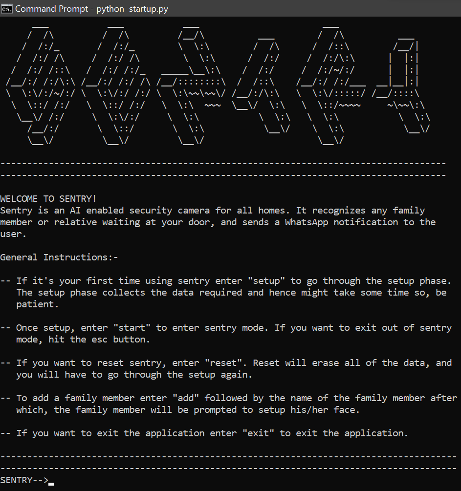

# Sentry
Sentry is a smart security camera built using Python and OpenCV. It uses real-time face recognition to identify family members. Face detection is done using the 
Haar Cascades object detection algorithm, and face recognition through the LBPH algortihm both of which are available to implement in OpenCV.

# Prerequisites
Python, pip, virtualenv, and the latest version of OpenCV are required to run this project. Once python is installed, install pip using the command ```sudo apt install python3-pip``` for linux, and ```py -m ensurepip --upgrade``` for windows. Once pip is installed, install virtualenv by running the command ```pip install virtualenv```.
To set up a virtual environment, open up the terminal, navigate to the directory where you want to create the virtual environment and run the command ```python3 -m venv .``` for linux, and ```python -m venv .``` for windows.
After the virtual envionment is set up, you need to activate it. Navigate to the directory where you have created the venv, and run the command ```Scripts\activate``` for Windows, and ```source activate``` for linux systems.
Once activated, run ```pip install requirements.txt``` to install the necessary packages to run the program.

# Methodology
This project consists of three main stages: Data Collection, Model Training, and Recognition.

## Data collection
In this stage the face data of all the people who you want to recognize is captured and stored in a directory called 'datasets'. This stage makes use of the Haar Cascades object detection algorithm which was proposed back in 2001. This algorithm uses a set of features called Haar features, and requires multiple positive and negative samples. What this algorithm does is tries to use the Haar features to differentitate between the positive samples and negative samples.
## Model Training
In this stage the face data is fed to the LBPH algorithm, that is trained to recognize the faces in the given dataset. LBPH or Local Binary Pattern Histogram, is an algorithm for recognizing faces. In the first step, for each pixel, a local binary pattern is generated to accentuate the features of the face, the picture is divided into a grid (usually 8 x 8),for each grid a histogram is calculated which become the features of the face, and finally all the histograms are concatenated which completes the training phase. For testing, a fresh face is given, and the algorithm applies the steps mentioned earlier to find the concatenated histogram. Finally, the distance between the new and old histogram is calculated which becomes the confidence of the prediction. The lower the confidence, the lower the distance, and the more accurate the prediction is.
## Recognition 
In the final stage, a fresh set of faces is given to the recognizer in the form of a video feed and it returns the id along with the confidence of it's prediction.

# Running the program
Now that we have gone through its implementation, we can run the program. To do so, open up the terminal, activate your venv, and run the command ```python startup.py```
following which, you will be prompted with the UI 

Go through the general instructions to set up sentry and once done you are all ready to go!.



Here is a working example. In this example I have gone through the set up stages.


